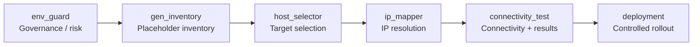

# Role: hybridops.common.connectivity_test

Connectivity validation across ICMP, SSH, Telnet, HTTP, and HTTPS.  
Designed to integrate with the Environment Guard Framework (EGF) and produce structured results suitable for CI gates and reviewable run records.

**License:** MIT-0 (code), CC BY 4.0 (docs)

---

## 1. Overview

This role performs multi-protocol reachability checks and writes machine-readable results (JSON and JSONL).  
It is typically used after governance and target-selection steps in the EGF pipeline, but can also be run standalone.

Protocols covered:

- ICMP (ping)
- SSH
- Telnet (optional)
- HTTP / HTTPS (GET and optional HEAD)

Outputs are written under a central logs root by default:

```text
output/logs/ansible/connectivity_logs/<run_id>/
  connectivity_report.json
  connectivity_report.jsonl
```

Each host’s result includes environment, OS family, inventory group, protocol status flags, timestamps, and correlation ID, making it suitable for both CI gates and reviewable run records.

---

## 2. EGF pipeline position

Typical EGF flow:

```text
env_guard → gen_inventory → host_selector → ip_mapper → connectivity_test → deployment
```

Mermaid view:



Related roles (same collection):

- `hybridops.common.env_guard`
- `hybridops.common.gen_inventory`
- `hybridops.common.host_selector`
- `hybridops.common.ip_mapper`

This role can still be used without the other EGF roles if you already have real hosts and addresses.

---

## 3. Defaults and result layout

Key defaults (from `defaults/main.yml`):

- Test knobs:
  - `ping_count: 2`
  - `connectivity_timeout: 3`
  - `tests_enabled.icmp: true`
  - `tests_enabled.ssh: true`
  - `tests_enabled.telnet: false`
  - `tests_enabled.http: true`
  - `tests_enabled.https: true`
- Paths:
  - `connectivity.paths.logs_dir: "{{ _project_root }}/output/logs/ansible"`
  - `connectivity.paths.connectivity_logs_dir: "{{ _project_root }}/output/logs/ansible/connectivity_logs"`
- Output files:
  - `connectivity.audit.report_prefix: "connectivity_report"`
  - `connectivity.audit.json_file: "connectivity_report.json"`
  - `connectivity.audit.jsonl_file: "connectivity_report.jsonl"`
  - `connectivity.audit.write_json: true`
  - `connectivity.audit.write_jsonl: true`

The role computes a `run_id` (UTC timestamp) and writes:

- Pretty JSON keyed by hostname: `connectivity_report.json`
- One-line-per-host JSONL stream: `connectivity_report.jsonl`
- A `latest` symlink pointing to the most recent run directory.

All of these defaults can be overridden in playbooks or inventory.

---

## 4. Correlation IDs (CID) and traceability

The role can tag results with a correlation ID for traceability across EGF.

Resolution order:

1. `correlation_id` (play or inventory)
2. `egf_correlation_id` (inherited from `env_guard` or caller)
3. `EGF_CORR_ID` (environment variable)

All values are normalised to lowercase.

Defaults:

```yaml
connectivity_use_cid: true
connectivity_inherited_cid: "{{ correlation_id | default(egf_correlation_id | default('', true), true) | lower }}"
connectivity_env_cid: "{{ lookup('env','EGF_CORR_ID') | default('', true) | lower }}"
connectivity_cid_pre: "{{ connectivity_inherited_cid or connectivity_env_cid }}"
```

Each host’s compiled `test_results` payload includes:

- `cid` – correlation ID (or empty if disabled)
- `env` – environment (for example `dev`, `staging`, `prod`)
- `hostname` – inventory hostname
- `ip` – resolved IP / `ansible_host`
- `os_family` – Ansible OS family (for example `Debian`, `RedHat`, `Windows`)
- `inventory_group` – primary inventory group label (for example `cicd_test`)
- Booleans per protocol: `icmp`, `ssh`, `telnet`, `http`, `http_head`, `https`, `https_head`
- `ts_utc` – timestamp for the test
- `tested_by` – control-node user executing the run

`inventory_group` is resolved as:

- An explicit `connectivity_inventory_group` variable when provided, or
- The first non-`all` group from `group_names`, or
- `"unknown"` as a last resort.

---

## 5. Example usage (standalone)

Minimal example against a production group:

```yaml
- name: Connectivity smoke test for production
  hosts: production_servers
  gather_facts: true
  vars:
    env: prod
    correlation_id: egf-20250909-01
    connectivity_inventory_group: "prod_app"
  roles:
    - role: hybridops.common.connectivity_test
```

This will:

1. Run ICMP/SSH/HTTP(S) checks per host.
2. Compile results into per-host `test_results` facts, including OS family and inventory group.
3. Write JSON + JSONL under `output/logs/ansible/connectivity_logs/<run_id>/`.

---

## 6. Test inventory and smoke test

A simple test inventory (no lab dependency) can look like:

```ini
[test_targets]
localhost ansible_host=127.0.0.1 ansible_connection=local

[all_test_hosts:children]
test_targets

[all_test_hosts:vars]
ansible_python_interpreter=auto_silent
```

From the collection root:

```bash
ansible-playbook   -i ansible_collections/hybridops/common/roles/connectivity_test/tests/inventory/test_inventory.ini   ansible_collections/hybridops/common/roles/connectivity_test/tests/smoke.yml
```

The smoke test:

- Executes the role against `test_targets`.
- Validates that JSON and JSONL outputs exist.
- Copies outputs into the role’s `tests/output/` directory for inspection.

---

## 7. CI/CD integration

A CI job (for example GitHub Actions or Jenkins) can treat connectivity outputs as a gate:

```yaml
- name: Run connectivity test
  run: |
    ansible-playbook       -i inventories/prod/test_inventory.ini       playbooks/connectivity.yml       -e env=prod       -e correlation_id=egf-20250909-01       -e connectivity_inventory_group=cicd_test

- name: Upload connectivity results
  uses: actions/upload-artifact@v4
  with:
    name: connectivity-artifacts
    path: output/logs/ansible/connectivity_logs/**
```

The role also publishes run metadata via `set_stats`, so downstream jobs can consume:

- `connectivity_logs_root`
- `connectivity_run_id`
- `connectivity_run_dir`
- `connectivity_json_path`
- `connectivity_jsonl_path`

---

## 8. Documentation and pipeline context

This role is one component of the Environment Guard Framework (EGF).  
Extended documentation, diagrams, and portfolio examples live on the docs site:

- [HybridOps docs](https://docs.hybridops.tech/guides/concepts/environments-and-guardrails.md) – EGF, connectivity flows, and platform guidance.

When used from Ansible Galaxy, treat this README as the primary reference and use the role names above for cross-navigation. The external documentation site provides the full pipeline narrative.

## Further documentation

- [Ansible role index](https://docs.hybridops.tech/guides/reference/ansible-role-index/)

## License

- Code: [MIT-0](https://spdx.org/licenses/MIT-0.html)  
- Documentation & diagrams: [CC BY 4.0](https://creativecommons.org/licenses/by/4.0/)

See the [HybridOps licensing overview](https://docs.hybridops.tech/briefings/legal/licensing/)
for project-wide licence details, including branding and trademark notes.
